# Quinki

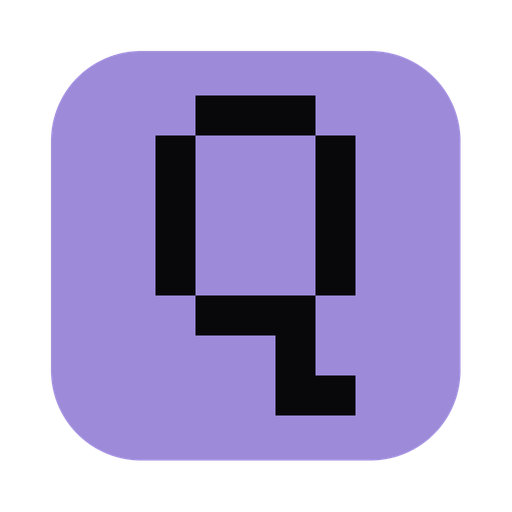

**Quinki, AI Agents: As simple as possible!**

A native desktop app for AI work: parallel multi-agent chats, scheduled tasks, a Market of community-built tools, and the App Expert to extend the app from inside it. Everything stays on your machine.


[](https://github.com/Upward991/Quinki/releases)


## Install

### App (macOS)

```sh
curl -fsSL https://raw.githubusercontent.com/Upward991/Quinki/main/install.sh | sh
```

Installing the app also installs the CLI automatically (`quinki` lands in `~/.local/bin`, PATH handled). Prefer a manual install? Download the `.dmg` from [Releases](https://github.com/Upward991/Quinki/releases), drag the app to Applications, and on first launch right-click it and choose Open.

### CLI (standalone)

The same sessions, agents and skills, in your terminal. Works without the app:

```sh
curl -fsSL https://raw.githubusercontent.com/Upward991/Quinki/main/install-cli.sh | sh
```

### Mobile and web

- **Android**: install the APK from [Releases](https://github.com/Upward991/Quinki/releases) (`Quinki_Android_*.apk`, and the companion `Quinki_Expert_Android_*.apk`).
- **iOS and any browser**: Quinki serves its own web UI (Settings, Web app). Open it from the phone, then Share, Add to Home Screen. It works on Android too, next to the APK.
- **Windows and Linux**: native builds come after macOS. The web UI already works everywhere.

> Re-running the installer always installs the latest release. New builds are published as new releases with notes on the [Releases](https://github.com/Upward991/Quinki/releases) page.

## Inside Quinki

**Home.** One click to everything: your sessions, tasks, agents, market, settings and log, in a grid you can rearrange.

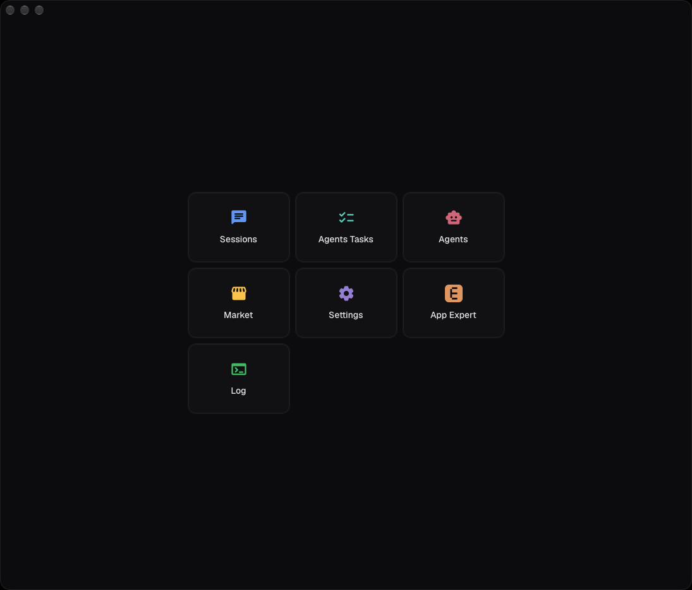

**Sessions.** Chats with your agents. Parallel sessions with visible delegation blocks, folders and notifications.

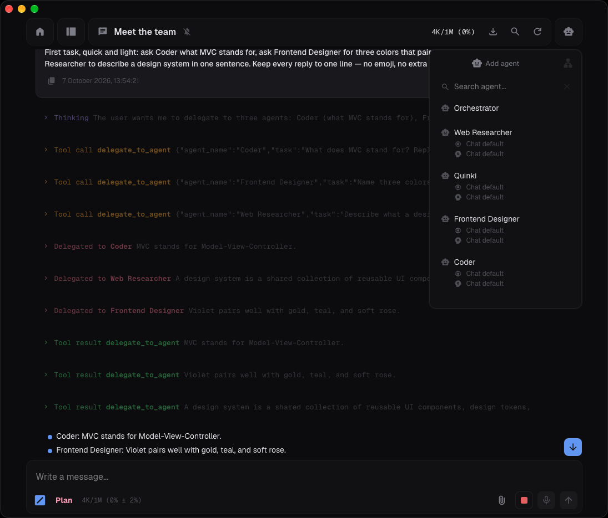

**Agents Tasks.** A calendar of agent work: scheduled jobs and running tasks, visible at a glance.

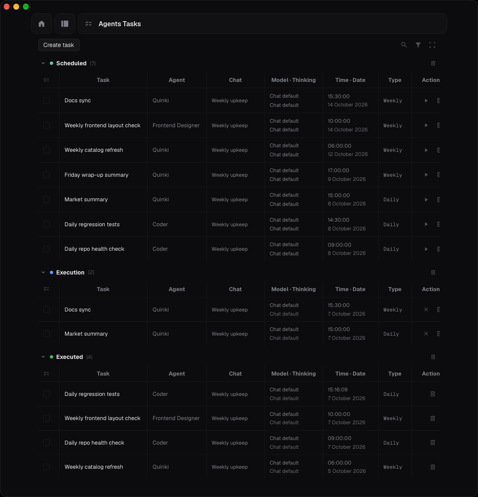

**Agents.** Create and manage your agents: prompts, tools, skills and models.

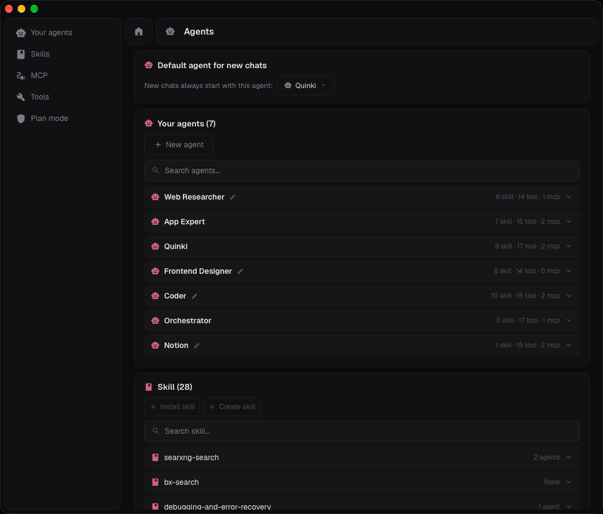

**Market.** Install skills, agents, tabs, MCP servers and themes from the built-in Market.

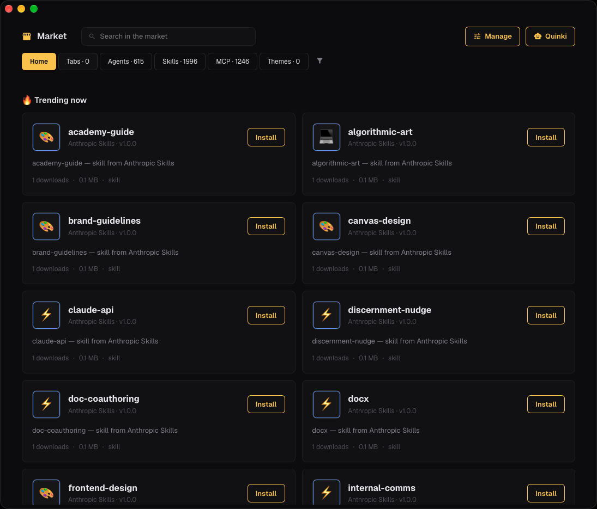

**Settings.** Providers and models, themes, remote access, app updates and more.

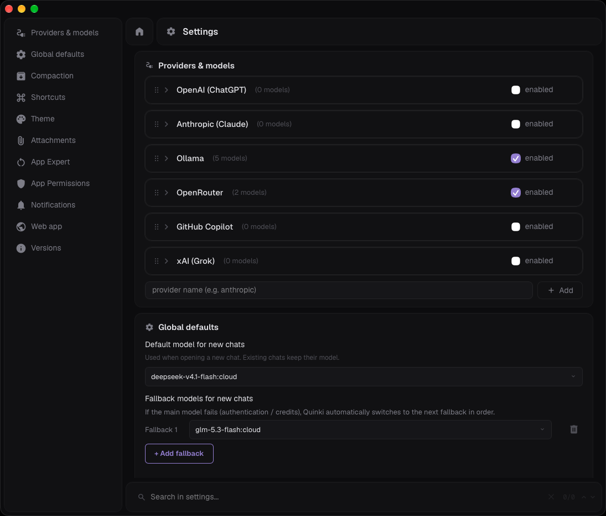

**App Expert.** The separate companion app: your in-house developer that reads Quinki code, makes changes, builds and installs.

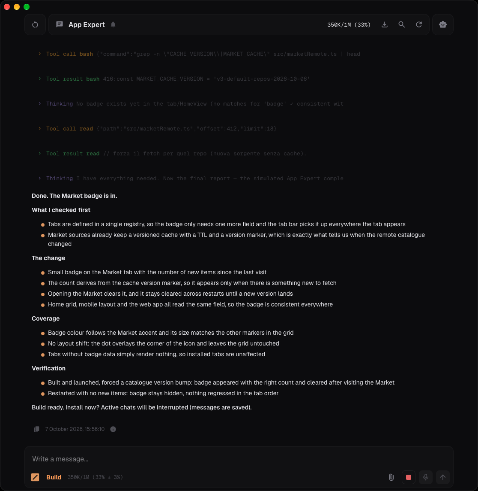

**Log.** A live debug log, so you always see what the app is doing under the hood.

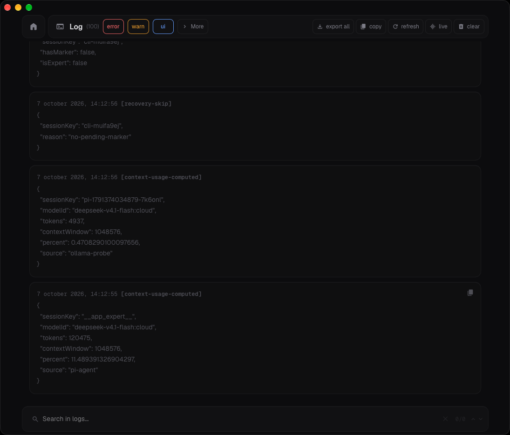

**CLI.** The whole Quinki in your terminal. Same sessions, agents and skills as the app.

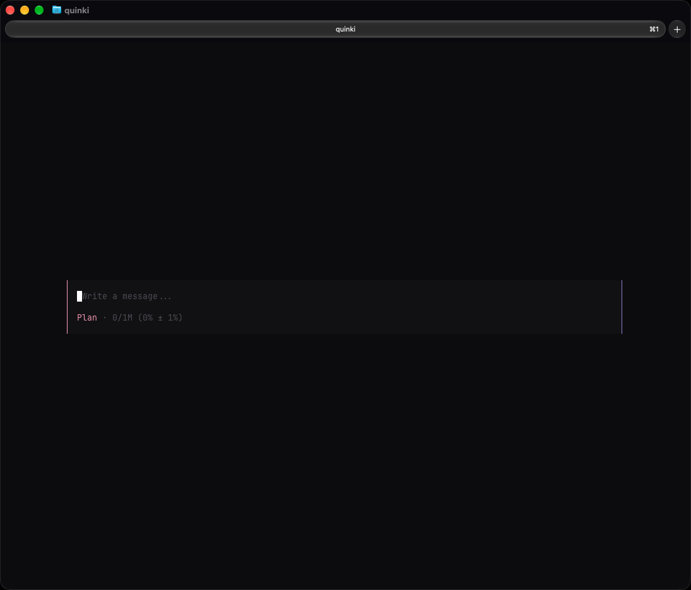

**CLI, slash menu.** Type / for the command menu: same actions, same look as the app.

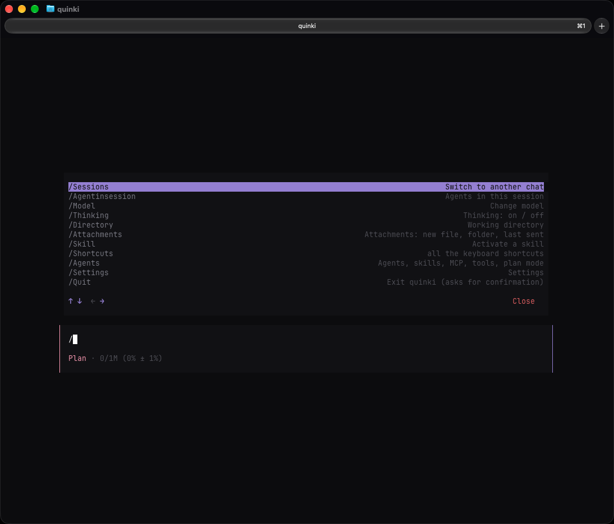

## What is Quinki?

Quinki is a desktop app with tabs: chat with AI agents, schedule tasks, browse the Market, manage your agents, all in one place. Create your own tabs with the App Expert, publish them to the Market, and install community-built tools. Everything runs locally on your Mac.

### Providers (built-in)

| Provider | Sign in with | Models |
|----------|-------------|--------|
| **OpenAI** | ChatGPT Plus/Pro subscription | GPT-5.4, GPT-5.5, GPT-5.6 series |
| **Anthropic** | Claude Pro/Max subscription | Claude Opus 5, Sonnet 5, Haiku 4.5 |
| **Ollama** | Free, runs locally on your Mac | Any local model (Llama, DeepSeek, etc.) |
| **OpenRouter** | Free account, pay-per-use | 200+ models from all providers |
| **GitHub Copilot** | Copilot subscription ($10/mo) | Claude + GPT models through Copilot |
| **xAI (Grok)** | SuperGrok or X Premium subscription | Grok 4.3-4.6 |

### Features

- **Chat** with streaming responses, thinking traces, and model switching mid-conversation
- **Agents** — create custom assistants with specific tools, skills, and model overrides
- **Skills** — teach agents specific tasks with SKILL.md files
- **Delegation** — let an orchestrator agent delegate to specialized agents
- **MCP** — connect Model Context Protocol servers (browser automation, search, databases, etc.)
- **Market** — browse and install community-made tabs, agents, skills, MCP servers, and themes
- **Scheduled Tasks** — tell an agent to do something later ("tomorrow at 7am, do X")
- **Long Horizon** — multi-step autonomous execution with planning and progress tracking
- **App Expert** — a built-in agent that can modify and improve Quinki itself
- **File Attachments** — drag files into chat, the model reads them
- **Themes** — 7 built-in themes, custom themes from the market
- **CLI** — the same Quinki in your terminal, sharing sessions, agents and skills

## Getting started

1. **Open Quinki** — you'll see a guided tutorial
2. **Go to Settings → Providers** — sign in with any subscription you have:
   - ChatGPT Plus/Pro → click "Sign in" on OpenAI
   - Claude Pro/Max → click "Sign in" on Anthropic
   - No subscription? → Set up Ollama (free, local models) or OpenRouter (free, pay-per-use)
3. **Pick a model** — the model selector in the chat header shows all your available models
4. **Start chatting!**

## Market

The [Quinki Market](https://github.com/Upward991/quinki-market) is the official package repository — browse it from within the app (Market tab).

### Default sources (preinstalled)

Quinki ships with a set of sources already configured. Remove them or add your own at any time:

| Repository | Contents |
|-----------|----------|
| [modelcontextprotocol/registry](https://registry.modelcontextprotocol.io) | The official MCP registry, around 1,200 installable MCP servers |
| [anthropics/skills](https://github.com/anthropics/skills) | Official Anthropic skills: canvas design, algorithmic art, brand guidelines |
| [alirezarezvani/claude-skills](https://github.com/alirezarezvani/claude-skills) | 800+ Claude skills across many domains |
| [obra/superpowers](https://github.com/obra/superpowers) | Development workflow: TDD, debugging, code review |
| [davila7/claude-code-templates](https://github.com/davila7/claude-code-templates) | 900+ templates and components for Claude Code |
| [modelcontextprotocol/servers](https://github.com/modelcontextprotocol/servers) | Official MCP servers: filesystem, git, search, memory, and more |
| [wshobson/agents](https://github.com/wshobson/agents) | 200 production-ready agent definitions |
| [contains-studio/agents](https://github.com/contains-studio/agents) | 37 specialist agents for product teams |
| [VoltAgent/awesome-claude-code-subagents](https://github.com/VoltAgent/awesome-claude-code-subagents) | A large collection of Claude Code subagents |
| [Jeffallan/claude-skills](https://github.com/Jeffallan/claude-skills) | 60+ focused Claude skills |

### How to add

In Quinki, go to **Market → My Repos → Add** and paste the repo name (e.g. `anthropics/skills`). The skills appear instantly in the catalog.

## App Expert

Quinki can modify and improve itself. Open the **App Expert** tab, set the source code directory (clone this repo), and tell it what to fix or build. It commits, builds, and installs, with your confirmation at every step.

## System requirements

- macOS 14+ on Apple Silicon (M1/M2/M3/M4)
- ~200MB disk space
- One of: ChatGPT Plus/Pro, Claude Pro/Max, GitHub Copilot, SuperGrok, or Ollama (free)

## Building from source

```bash
# Clone
git clone https://github.com/Upward991/Quinki.git
cd Quinki

# Install dependencies
bun install

# Build the sidecar (requires Bun)
cd sidecar-src && bun install && cd ..
bash scripts/build-sidecar.sh

# Build the app (requires Rust)
npx tauri build
```

The built app appears in `src-tauri/target/release/bundle/macos/Quinki.app`.

## Support the project

Quinki is free and open source.

**Donate**: [GitHub Sponsors](https://github.com/sponsors/Upward991)

## Report issues

Found a bug? [Open an issue](https://github.com/Upward991/Quinki/issues) with:
- What you were doing
- What happened vs what you expected
- macOS version and model used

## Contact

Questions or feedback? [Contact](mailto:quinki.inbox@gmail.com)

## License

AGPL-3.0. See [LICENSE](LICENSE) for details.

The source is open: you can study it, modify it, and build it. Any distribution of modified versions must also be AGPL-3.0 and include the source code.

---

<div align="center">
Made with ❤️ in Italy 🇮🇹

*If Quinki saves you time, consider [supporting it](https://github.com/sponsors/Upward991).*
</div>
